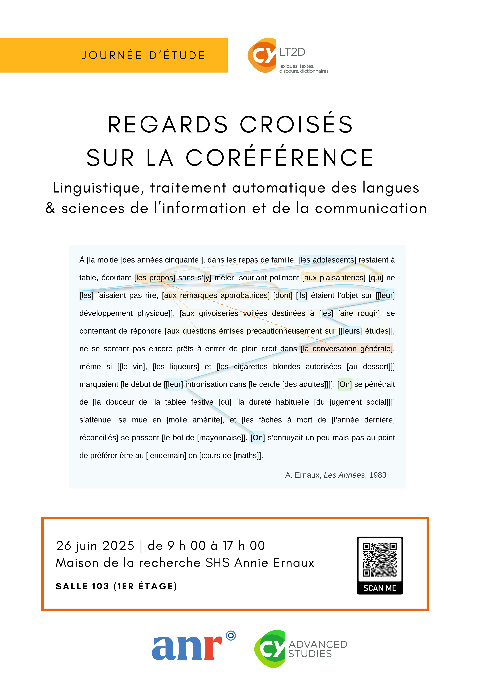

# REGARDS CROISÉS SUR LA CORÉFÉRENCE

Les expressions référentielles désignant un même référent constituent les maillons d’une chaîne de référence, liés par une relation de coréférence. Ce phénomène fait l’objet de travaux en linguistique d’un point de vue syntaxique, sémantique et discursif. Des travaux sur la coréférence s’inscrivent aussi en acquisition du langage, en didactique, en psycholinguistique, en traitement automatique des langues (TAL) ou encore dans le domaine des études littéraires. Si les cadres théoriques et les méthodes d’analyses diffèrent selon les disciplines, un dialogue interdisciplinaire pourrait permettre un enrichissement réciproque des approches. Cette journée d’étude entend proposer une réflexion structurée autour de trois sessions thématiques : (1) la caractérisation linguistique des chaînes et de leurs maillons, (2) la coréférence en corpus et la détection automatique en TAL et (3) l’étude des chaînes avec leur contexte. Au-delà de représenter une diversité d’approches et de points de vues, les travaux  présentés permettront de nourrir une réflexion à propos de l’adaptation croisée d’outils et de méthodes pour l’étude de la coréférence en linguistique et en TAL, en envisageant leur réutilisation en sciences de l’information et de la communication. 

Cette journée bénéficie du soutien de [CY Advanced Studies](https://advancedstudies.cyu.fr/) et de l’Agence Nationale de la Recherche dans le cadre d’un financement de la Chaire de Professeure Junior « [Ressources numériques en SHS](https://www.cyu.fr/marine-delaborde ) » portée par Marine Delaborde. 

## Informations pratiques
- **Contact** : marine.delaborde@cyu.fr
- **Date** : 26 juin 2025
- **Lien visioconférence** : [Teams](https://teams.microsoft.com/l/meetup-join/19%3ameeting_MTFhNGY3YTctZGVlOS00OTExLThkZTUtODMzNWRmNmFhYzFm%40thread.v2/0?context=%7b%22Tid%22%3a%22b8c19512-2aed-471d-a8d1-9b06e7da786a%22%2c%22Oid%22%3a%22311f66ee-7ff8-4d35-9d56-846da7776e26%22%7d)
- **Lieu** : Salle 103 (1er étage), Maison de la recherche SHS Annie Ernaux, 33 Boulevard du Port 95000 Cergy-Pontoise
- [Plan d'accès](plan_mdr_shs.png)

## Programme

<embed src="PROGRAMME_JE.pdf" width="600" height="500" type="application/pdf">

## Livret

<embed src="Livret_JE_COREFERENCE_25.pdf" width="600" height="500" type="application/pdf">

[Page d'accueil (Marine Delaborde)](../../)