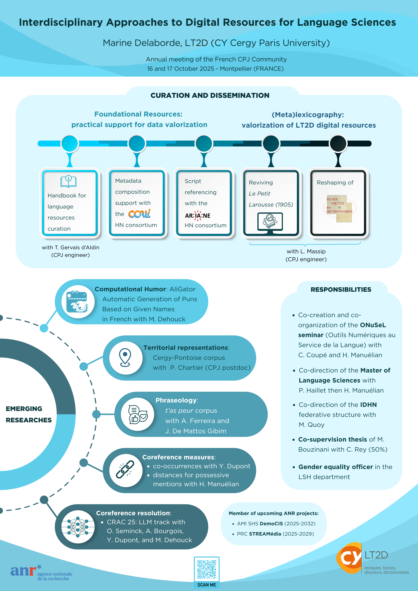

# Marine Delaborde
- **Poste actuel** : professeure junior à [CY Cergy Paris Université - LT2D](https://lt2d.cyu.fr)
- Membre associé au laboratoire [Lattice - CNRS - ENS](https://www.lattice.cnrs.fr)

# Contact
- **Page professionnelle** :  [https://www.cyu.fr/marine-delaborde](https://www.cyu.fr/marine-delaborde)
- **LinkedIn** : [https://www.linkedin.com/in/marine-delaborde/](https://www.linkedin.com/in/marine-delaborde/)

# Journée d'étude
- [Regards croisés sur la coréférence](coreference/je25.md)

# Offres d'emploi / de stage 
- [Stage  - Humour et IA : génération automatique](postes/Fiche-de-Poste-Stage-26-LT2D.pdf) (février - juin 2025)
- Ingénieur d'études  - Humour et IA : détection automatique (offre à venir)

# Chaire de professeure junior "Ressources numériques en SHS"

